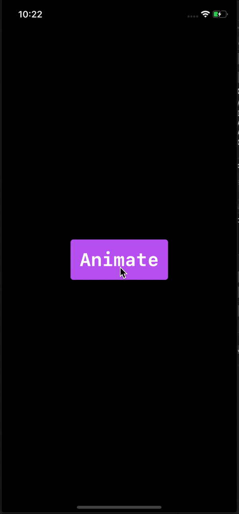

# SwiftUI-Animations
Implement Animations in SwiftUI.

    

## Button Animation

[**View Code**](https://gitlab.com/shraddha.sojitra/swiftui-animations/-/tree/master/AnimatedButton)

## Like and Share
If you liked the animations then  give it a star ⭐️ and share it with your friends!

## Author

11Shraddha, shraddhasojitra11@gmail.com
